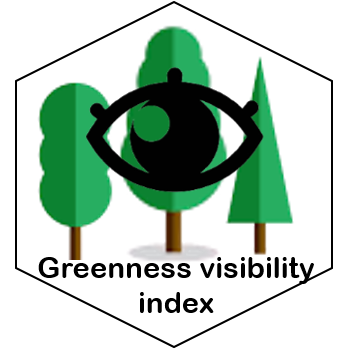

# Greenness Visibility Index 

This software uses a Python Viewshed implementation to calculate a GVI surface from a DSM, DTM and Binary Greenness Surface. It is part of the paper published at:

[Labib, S.M., Huck, J.J. and Lindley, S., 2021. Modelling and mapping eye-level greenness visibility exposure using multi-source data at high spatial resolutions. **Science of the Total Environment**, 755, p.143050](https://doi.org/10.1016/j.scitotenv.2020.143050). 

## Usage

This software is designed to run in a parallel computing environment, but can also be run on a single process. It is called using a simple command line interface (CLI). Note that you should call `parallel.py`, even if you only want to run the script on a single core. Here is an example call:

```bash
python parallel.py 0 1 -l -b
```

In this repository there are input files included to run a small test with the command above.

Here are the arguments and explanations:

```
Run green visibility index calculation.

positional arguments:
  -tp             number of parts to split
  -p              part to process

options:
  -h, --help      show this help message and exit
  -l, --landbouw  enable landbouw
  -b, --blauw     enable blauw
```

The inputs for the model comprise:

* *Raster datasets:* Digital Elevation/Terrain Model (DEM/DTM), Digital Surface Model (DSM) and a binary Greenspace layer (1=green, 0=not green)
  * The code expects the files in a input_folder and a year folder.
  * dsm_path = rf"input_data/{year}/DSM_{res}m{name_postfix}.tif"
  *  dtm_path = rf"input_data/2015/DTM_{res}m{name_postfix}.tif"
  * green_path = rf"input_data/{year}/green_01{landbouw_str}{blauw_str}_{res}m{name_postfix}.tif" 

  * out_path = rf"output/{year}/green_vis_vl_{res}m_{padding}m{landbouw_str}{blauw_str}_{part_nr}{output_name_postfix}.tif"
* *Vector datasets:* 
    * grid_path = rf"input_data/{grid}{name_postfix}.gpkg"

* The viewshed radius is fixed to 800 meters (can be changed in the main)
* The years are fixed to 2022 and 2015. should be changed in the parallel.py file
* the resolution can be changed in the main method. we used 1 and 5 meters.

For parallel computing, the input grid should be split into squares. the -tp and -p parameters are used to split the runs.
We run it on a slurm cluster with the following command:
```bash
#!/bin/bash
#SBATCH --job-name=green_vis_array_test
#SBATCH --nodes=1
#SBATCH --ntasks=1
#SBATCH --cpus-per-task=10
#SBATCH --mem=16gb
#SBATCH --time=14-00:00:00
#SBATCH --array=0-1000
#SBATCH --partition=normal

source activate green_vis
cd ~/green-visibility-index/
python parallel.py $SLURM_ARRAY_TASK_COUNT $SLURM_ARRAY_TASK_ID -l -b
```

using #SBATCH --array=0-1000 will run the script 1000 times with different parts.
Making 1000 jobs on the queue.
Our total input was around 3500 squares in the grid, so each job processes 3-4 tiles.

## Other languages

An R port of this repository is available at: [](https://github.com/STBrinkmann/GVI)
